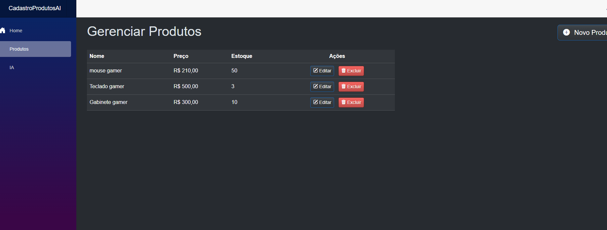
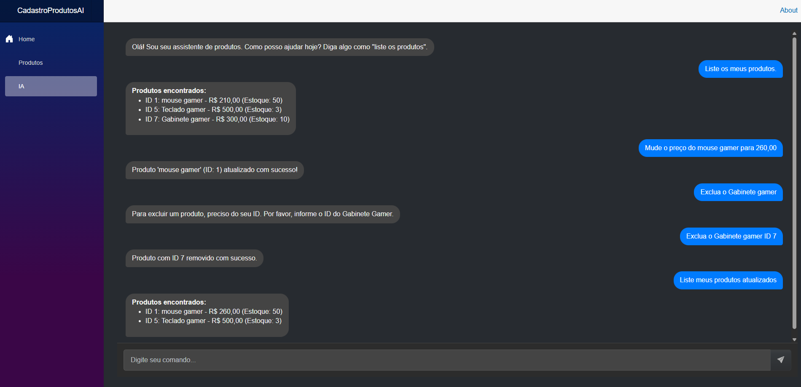

# 🤖 AI-Powered Product CRUD

Um sistema web para gerenciamento de produtos (CRUD) construído com C# e Blazor, com uma interface de chat integrada que utiliza a API do Google Gemini para executar operações de banco de dados através de linguagem natural.

---

## 🚀 Demonstração

### Tela de Gerenciamento de Produtos
A interface principal permite a criação, leitura, atualização e exclusão de produtos de forma visual e intuitiva, com um tema dark moderno.

### Assistente com Inteligência Artificial
Uma interface de chat que interpreta comandos em português para manipular os dados dos produtos, como listar, adicionar, remover, consultar e atualizar itens.

---

## 💻 Tecnologias Utilizadas
- **Backend:** C# (.NET 8)
- **Frontend:** Blazor Server
- **Banco de Dados:** MySQL
- **Inteligência Artificial:** Google Gemini API
- **Arquitetura:** 3 Camadas (Core, Data/Repository, Services)

---

## ✨ Funcionalidades
- [x] CRUD completo de produtos (Criar, Ler, Atualizar, Excluir).
- [x] Interface de chat para controle via comandos de texto.
- [x] Processamento de Linguagem Natural com Google Gemini para traduzir texto em ações de banco de dados.
- [x] Interface web responsiva com tema dark e design profissional.
- [x] Conexão segura com o banco de dados usando padrão de repositório.

---

## 🔧 Como Executar Localmente

1. Clone o repositório.
2. Configure a string de conexão com o MySQL no arquivo `src/Web/appsettings.Development.json`.
3. Adicione sua chave de API do Google Gemini no mesmo arquivo.
4. Execute o comando `dotnet run --project src/Web` na pasta raiz.
